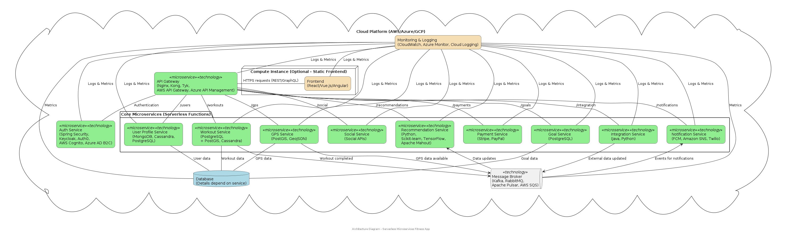

# Базовая архитектура

### Резюме

#### Бизнес-требования

1. Регистрация/авторизация пользователей.
2. Отслеживание тренировок (разные типы, GPS, данные с датчиков).
3. Просмотр истории тренировок и статистики.
3. Персонализированные рекомендации по тренировкам и планам.
4. Установка целей и отслеживание прогресса.
5. Интеграция с внешними фитнес-трекерами и сервисами.
6. Уведомления и напоминания.
7. Интеграция с социальными сетями.
8. Автономный режим (ограниченная функциональность).
9. Подписка на платные функции.
10. Возможности социального взаимодействия между пользователями (дополнительно, может быть развернуто позже).

#### Нефункциональные требования

1. Производительность:  Низкая задержка ответов, обработка большого количества одновременных пользователей, масштабируемость.
2. Надежность:  Отказоустойчивость, автоматическое восстановление после сбоев, резервное копирование и восстановление данных.
3. Безопасность:  Защита персональных данных пользователей, безопасная авторизация и аутентификация, защита от несанкционированного доступа.
4. Масштабируемость:  Горизонтальное масштабирование отдельных компонентов для обработки растущей нагрузки.
5. Доступность:  Высокая доступность сервиса (например, 99.9%).
6. Поддержка:  Простота мониторинга, диагностики и обновления системы.
7. Расширяемость:  Возможность добавления новых функций и интеграций без существенных изменений существующей архитектуры.
8. Конфиденциальность:  Данные пользователей должны храниться и обрабатываться в соответствии с нормативными требованиями (например, GDPR).

#### Выбранная архитектура:  Микросервисная архитектура с событийным подходом (Event-Driven Microservices)

Микросервисы позволяют независимо разрабатывать, развертывать и масштабировать отдельные функциональные блоки приложения.  Событийный подход обеспечивает слабую связанность между сервисами, повышает гибкость и отказоустойчивость.  Это оптимально для решения бизнес-задач, удовлетворения НФТ и адресации атрибутов качества.

### Компоненты архитектуры

1. API Gateway.  Точка входа для всех клиентских запросов.  Выполняет аутентификацию, авторизацию, маршрутизацию запросов к соответствующим микросервисам, агрегацию ответов и лимитирование запросов (rate limiting).

**Технологии**:  Nginx, Kong, Tyk, AWS API Gateway, Azure API Management.

2. Сервис Аутентификации и Авторизации (Auth Service).  Управляет регистрацией пользователей, аутентификацией, авторизацией и управлением токенами (например, JWT).

**Технологии**:  Spring Security (Java), Keycloak, Auth0, AWS Cognito, Azure AD B2C.

3. Сервис Профилей Пользователей (User Profile Service).  Хранит и управляет информацией о пользователях (имя, возраст, пол, настройки и т.д.).

**Технологии**:  MongoDB, Cassandra, PostgreSQL.

4. Сервис Тренировок (Workout Service).  Обрабатывает информацию о тренировках, включая создание, отслеживание, сохранение и просмотр данных.

**Технологии**:  PostgreSQL (с расширением PostGIS для работы с геоданными), Cassandra.

5. Сервис GPS (GPS Service).  Обрабатывает GPS-данные для отслеживания маршрутов тренировок.

**Технологии**:  PostGIS, GeoJSON.

6. Сервис Рекомендаций (Recommendation Service):  Генерирует персонализированные рекомендации по тренировкам на основе данных пользователя, истории тренировок и целей.  Может использовать алгоритмы машинного обучения.

**Технологии**:  Python (Scikit-learn, TensorFlow), Apache Mahout.

7. Сервис Целей (Goal Service).  Управляет установкой целей и отслеживанием прогресса пользователей.

**Технологии**:  PostgreSQL.

8. Сервис Интеграции (Integration Service).  Обрабатывает интеграцию с внешними фитнес-трекерами и сервисами (Fitbit, Apple Health, Google Fit и т.д.).  Использует API соответствующих сервисов.

**Технологии**:  Java, Python.

9. Сервис Уведомлений (Notification Service).  Отправляет уведомления и напоминания пользователям через различные каналы (push-уведомления, email, SMS).

**Технологии**:  Firebase Cloud Messaging (FCM), Amazon SNS, Twilio.

10. Сервис Социальных Сетей (Social Service):  Обеспечивает интеграцию с социальными сетями для обмена информацией о тренировках и достижениях.

**Технологии**:  Использование соответствующих API социальных сетей.

11. Сервис Платежей (Payment Service):  Обрабатывает платежи за подписку на платные функции.

**Технологии**:  Stripe, PayPal.

12. Message Broker (Шина Сообщений):  Обеспечивает асинхронное взаимодействие между микросервисами через события.

**Технологии**:  Kafka, RabbitMQ, Apache Pulsar, AWS SQS.

13. База Данных:  Используется несколько типов баз данных, оптимизированных для различных задач:

- **Реляционные базы данных (PostgreSQL)**:  Для хранения структурированных данных, таких как информация о пользователях, тренировках и целях.
- **NoSQL базы данных (MongoDB, Cassandra)**:  Для хранения неструктурированных данных, таких как данные телеметрии с датчиков, GPS-данные и сессии пользователей.
- **Кэш (Redis, Memcached)**:  Для кэширования часто используемых данных для повышения производительности.

14. Мониторинг и Логирование:  Система мониторинга и логирования для отслеживания состояния системы, выявления проблем и анализа производительности.

**Технологии**:  Prometheus, Grafana, ELK Stack (Elasticsearch, Logstash, Kibana), Jaeger (для tracing).

### Событийный Подход (Event-Driven)

Микросервисы взаимодействуют друг с другом, публикуя и подписываясь на события.
Например:
Событие "UserRegistered":  Публикуется сервисом аутентификации при регистрации нового пользователя.  Сервис профилей пользователей подписывается на это событие и создает профиль пользователя.
Событие "WorkoutCompleted":  Публикуется сервисом тренировок после завершения тренировки.  Сервис рекомендаций подписывается на это событие и обновляет историю тренировок пользователя для генерации рекомендаций.

### Диаграмма архитектуры

### Адресация атрибутов качества

|Атрибут качества|Стратегия адресации|Компоненты|
|-|-|-|
|Производительность|Кэширование данных   Горизонтальное масштабирование микросервисов   Оптимизация запросов к базам данных   Асинхронная обработка задач через message broker| API Gateway, Service Mesh (если используется), Cache (Redis, Memcached), Базы данных, Message Broker|
|Надежность|Репликация данных   Автоматическое восстановление микросервисов после сбоев (Kubernetes)   Использование Circuit Breaker паттерна   Мониторинг и оповещения|Kubernetes, Service Mesh (если используется), Базы данных, Мониторинг и Логирование|
|Безопасность|Аутентификация и авторизация на основе токенов (JWT)   Шифрование данных при передаче и хранении   Регулярные проверки безопасности   Защита от DDoS атак (API Gateway, CDN)|API Gateway, Auth Service, Service Mesh (если используется), Все компоненты, хранящие данные|
|Масштабируемость|Микросервисная архитектура позволяет масштабировать отдельные компоненты независимо   Использование Kubernetes для автоматического масштабирования   Горизонтальное масштабирование баз данных|Все микросервисы, Kubernetes, Базы данных|
|Доступность|Репликация микросервисов и баз данных   Использование балансировщиков нагрузки (Load Balancers)   Мониторинг и автоматическое восстановление|Kubernetes, Load Balancers, Базы данных, Мониторинг и Логирование|
|Поддержка|Централизованное логирование и мониторинг   Использование инструментов для tracing (Jaeger)   Стандартизация процессов разработки и развертывания (CI/CD)|Мониторинг и Логирование, CI/CD pipeline, Infrastructure as Code (Terraform, Ansible)|
|Расширяемость|Микросервисная архитектура позволяет добавлять новые функции и интеграции без существенного влияния на существующие компоненты   Событийный подход облегчает добавление новых подписчиков на события|Все микросервисы, Message Broker|
|Конфиденциальность|Шифрование данных   Управление доступом на основе ролей (RBAC)   Соответствие нормативным требованиям (GDPR, HIPAA)   Анонимизация и псевдонимизация данных|Все компоненты, хранящие и обрабатывающие данные, Auth Service|